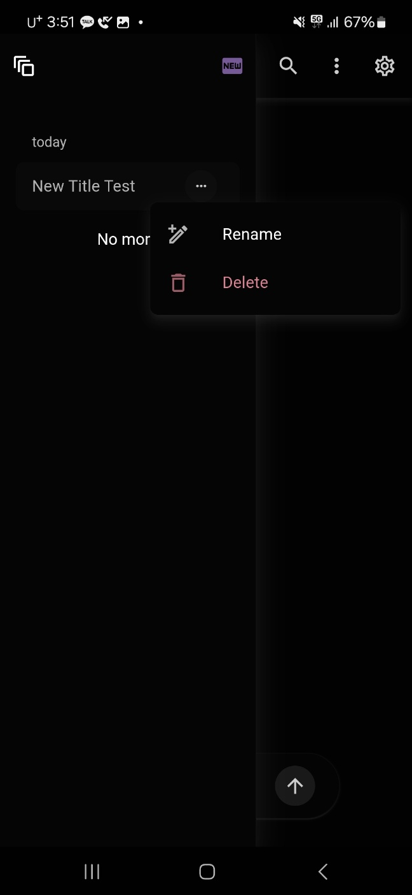
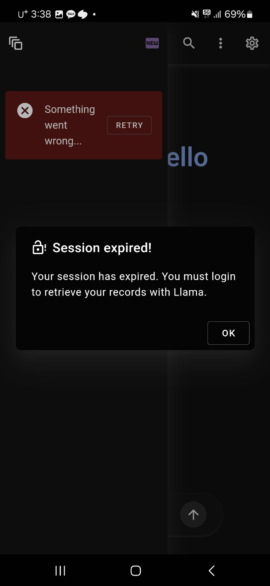
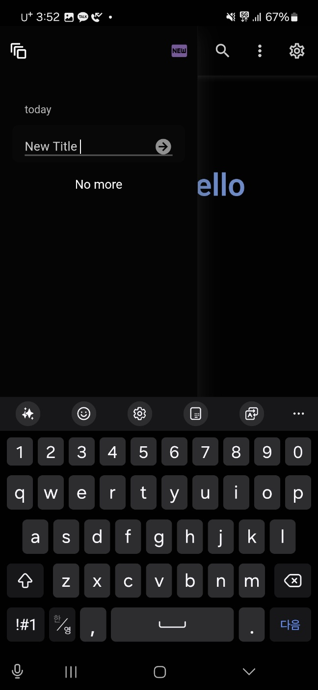
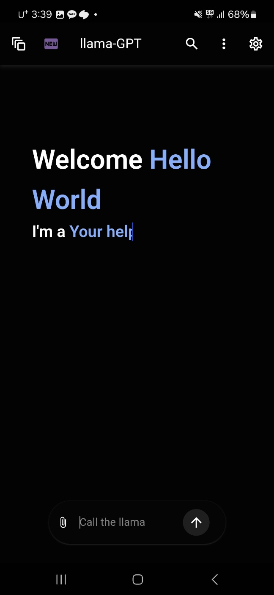
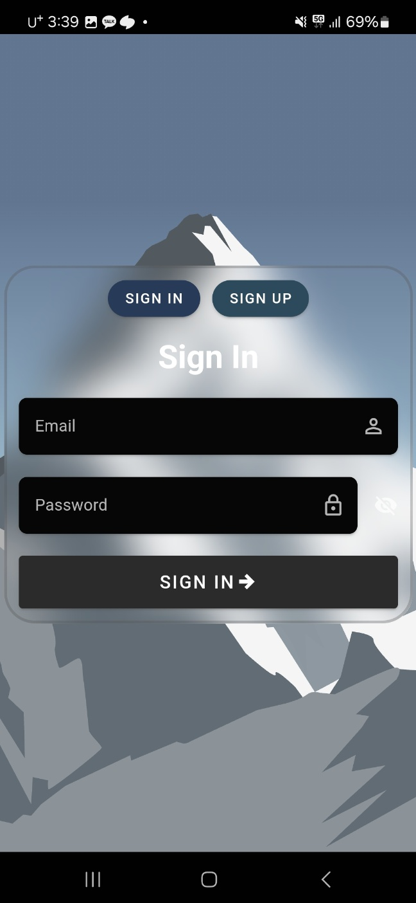
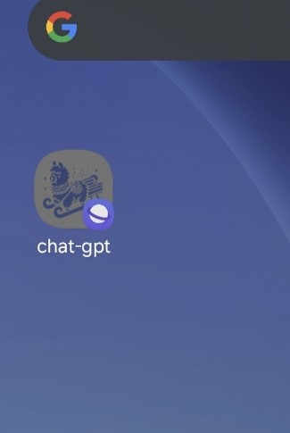
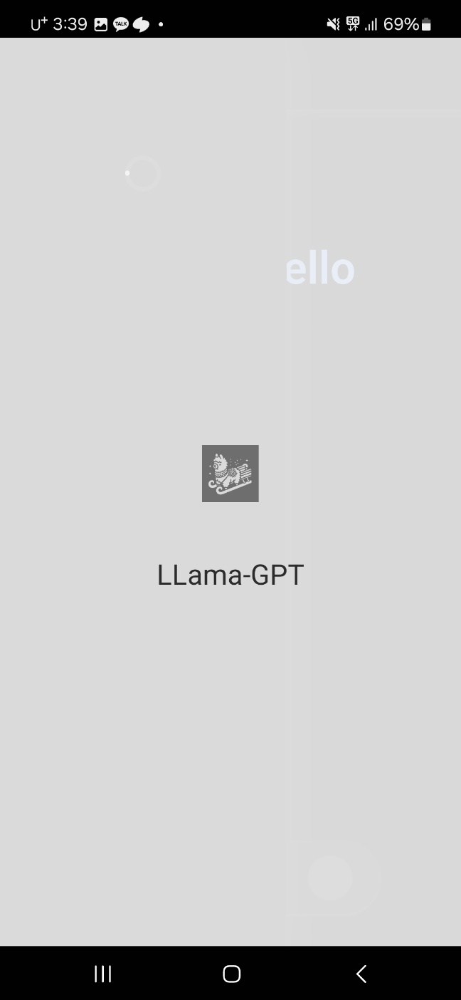

# nuxt-local-llama
nuxt-local-llama

- Meta-llama.3.2 사용
- Node-llama-cpp 사용 

## Local-AI 를 사용하는 repo 
> 일단 이거 하나만 하고 보류

목표 

- ✅ Nuxt 풀스택으로 프로젝트 
- ✅ mongodb사용 
- ✅ local ai를 사용해서 개발
- ✅ Aws배포 
- ✅ PWA 배포
- ✅ https domain연결
- ✅ http2로 연결 
- ❌ local에 모델을 두고 장기적으로 배포 관리 
  - > local에 ai모델을 사용하려면 VRAM이 필수인데 GPU가 포함된 인스턴스는 너무 비싸다... 한달에 약 40정도...

> http2는 다른문서에 있다. 

https 연결된 모습

# 주요 기능
## GIF

# PWA

### 데스크탑

# 모바일 화면 
      